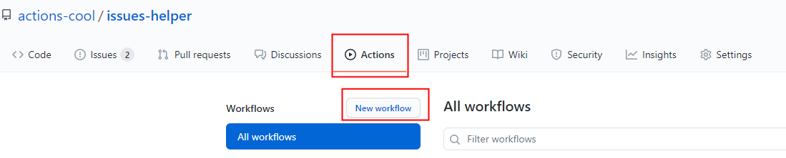
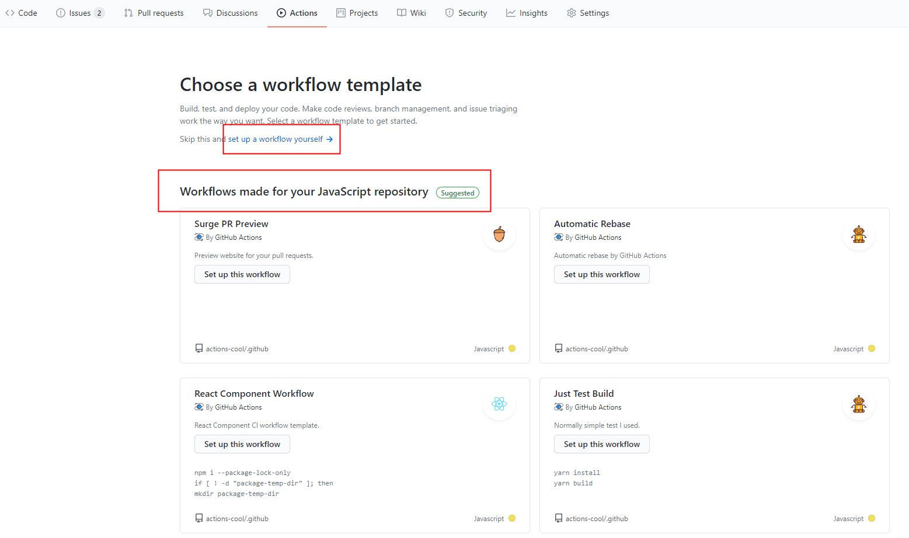

---
nav:
  title: 指南
toc: menu
---

# 🍭 指 南

Issues 助手是一个轻松帮你自动管理 issues 的 GitHub Action。

## GitHub Actions 是什么？

GitHub Actions 是由 GitHub 官方提供在存储库中自动化、自定义和执行软件开发工作流程。您可以发现，创建和共享操作以执行所需的任何工作（包括CI / CD），并在完全定制的工作流程中组合操作。[更多介绍](https://docs.github.com/en/free-pro-team@latest/actions)。

`issues-helper` 就是以次为基础，利用 GitHub Actions 来帮你处理各种关于 issue 方面的操作。

## 快速开始

### 1. 新建一个 Action

点击仓库的 Actions，若已增加过 Actions，会显示如下界面。

点击 `New workflow` 新增。

<Alert type="success">
你可以点击 <Badge>set up a workflow yourself</Badge> 新增一个自定义 action，也可以根据模板来套用新增一个 action。<a target="_blank" href="https://github.com/actions-cool/.github">模板使用</a>。
</Alert>

### 2. 编写 Action

Actions 地址是固定的，为 `/.github/workflows/xx.yml`。编写参考：

- YML 语法简介
- [GitHub Actions 语法](https://docs.github.com/en/free-pro-team@latest/actions/reference/workflow-syntax-for-github-actions#on)
- [工作流触发机制](https://docs.github.com/en/free-pro-team@latest/actions/reference/events-that-trigger-workflows)
